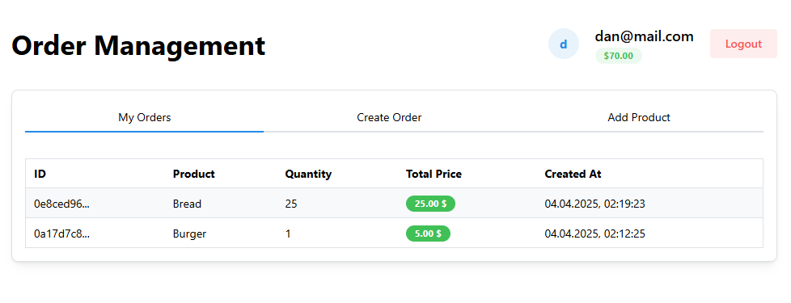

# Order Management Web Interface

Modern web application for order management with an intuitive interface and rich functionality.



## Technologies

-   **Framework**: React 19 + Vite
-   **Programming Language**: TypeScript
-   **Styling**: Mantine UI + Tailwind CSS
-   **Routing**: React Router v7
-   **State Management**: Zustand
-   **API Integration**: React Query, Axios
-   **Validation**: Zod
-   **Containerization**: Docker

## Project Structure

```
web/
│
├── src/                      # Application source code
│   ├── app/                  # Application core
│   │   ├── providers/        # Providers (Redux, React Query)
│   │   ├── routes/           # Routes configuration
│   │   └── styles/           # Global styles
│   │
│   ├── pages/                # Page components
│   │   ├── auth/             # Authentication page
│   │   └── orders/           # Orders page
│   │
│   ├── features/             # Business functionality
│   │   ├── auth/             # Authentication (login/registration)
│   │   ├── create-order/     # Order creation
│   │   ├── create-product/   # Product addition
│   │   └── order-list/       # Order list
│   │
│   ├── entities/             # Business entities
│   │   └── user/             # User entity
│   │
│   ├── shared/               # Reusable code
│   │   ├── api/              # API configuration
│   │   └── tokenStorage/     # Auth token management
│   │
│   └── main.tsx              # Entry point
│
├── public/                   # Public static files
├── .vscode/                  # VS Code settings
├── Dockerfile                # Docker image build instructions
├── tsconfig.json             # TypeScript configuration
└── package.json              # Project dependencies and scripts
```

## Local Setup

### Requirements

-   Node.js (v18+)
-   pnpm

### Installing Dependencies

```bash
pnpm install
```

### Development Mode

```bash
pnpm dev
```

The application will be available at: http://localhost:5173

### Production Build

```bash
pnpm build
```

Built files will be placed in the `dist/` directory.

## Environment Variables

The project uses the following environment variables:

-   `VITE_BASE_URL` — URL for API requests (default is "http://localhost:5000")

## Docker

The project can be run in a Docker container:

```bash
# Build the image
docker build -t order-management-web .

# Run the container
docker run -p 8080:80 order-management-web
```

## Key Features

The web interface provides the following functionality:

-   **User Authentication**:

    -   Login
    -   New user registration

-   **Order Management**:

    -   View order list
    -   Create new orders
    -   Filtering and sorting

-   **Product Management**:

    -   Add new products
    -   View catalog

-   **User Profile**:
    -   User information
    -   Account balance
    -   Transaction history

## Application Architecture

The application is built according to Feature-Sliced Design (FSD) principles, which provides:

-   Modularity and feature isolation
-   Ease of adding new features
-   Component reusability
-   Better testability

## Development Guidelines

-   Follow the FSD architecture when adding new functionality
-   Use React Query for API requests
-   Use @mantine/form library for forms
-   Use ready-made components from Mantine UI for styling
-   Follow TypeScript rules, defining types for all entities

## API Integration

The frontend interacts with the API server to perform the following operations:

-   User authentication
-   Retrieving order lists
-   Creating new orders
-   Managing products
-   Getting statistics
